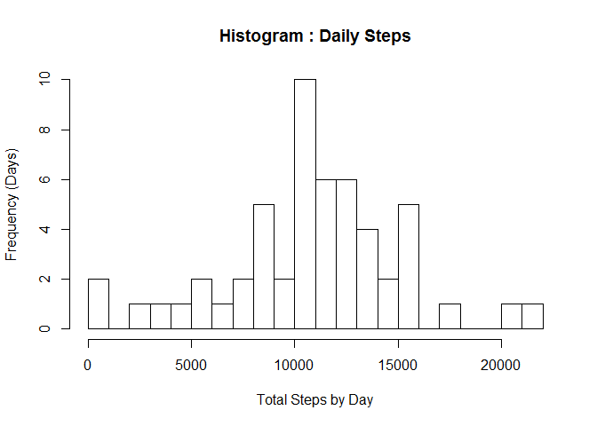
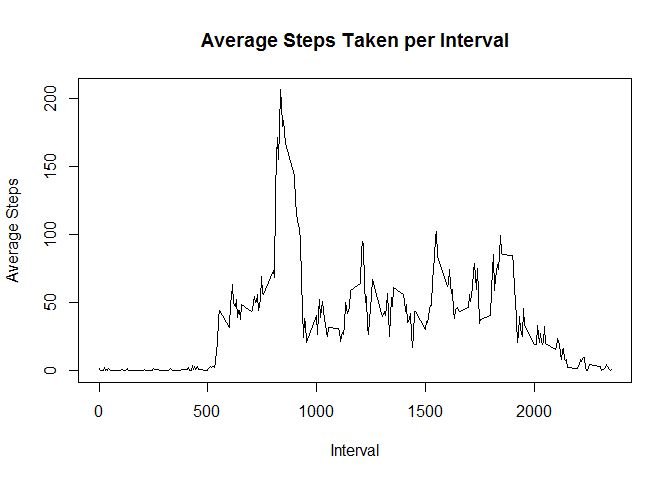
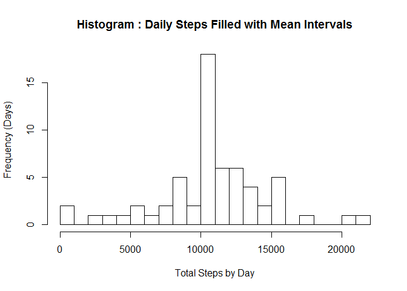
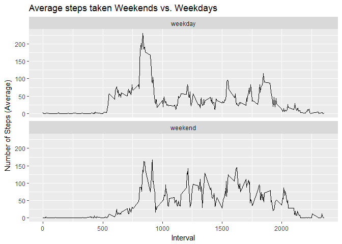

# Reproducible Research: Peer Assessment 1


## Loading and preprocessing the data

Load required libraries.


```r
library(dplyr)
library(sqldf)
library(ggplot2)
```

It is assumed the markdown file and the data CSV are in the same directory.


```r
## activity.zip was already found in the forked repository for the project.
## This produces activity.csv.
unzip("activity.zip")
```

Load the data in a dataframe.   Also add an "ActivityDate" column that converts the text dates into real date time values.


```r
activityData <- read.csv("activity.csv", na.strings = "NA")
activityData <- 
  data.frame(activityData, ActivityDate = strptime(activityData$date, "%Y-%m-%d"))
```

## What is mean total number of steps taken per day?

To get the steps per day it is required to group by day and then summarize the total steps.


```r
stepsSumPerDay1 <- activityData %>% 
  group_by(ActivityDate) %>% 
  summarize(DailyStepCount = sum(steps))
```

From here the graph can be created.

The bars were grouped in sizes of 1000.  Ultimately this could be changed if desired via "binGroupSize1".


```r
binGroupSize1 <- 1000
breakByBinGroupSize1 <- ceiling(max(stepsSumPerDay1$DailyStepCount, na.rm = TRUE) / binGroupSize1)
hist(stepsSumPerDay1$DailyStepCount, 
     xlab="Total Steps by Day",
     ylab="Frequency (Days)",
     main="Histogram : Daily Steps", 
     breaks=breakByBinGroupSize1)
```

<!-- -->


```r
## Code to compute the median and mean values of the daily steps.
stepMedian1 <- median(stepsSumPerDay1$DailyStepCount, na.rm = TRUE)
stepMean1 <- mean(stepsSumPerDay1$DailyStepCount, na.rm = TRUE)
```

As show in the code above, the median step value is **10765** and the mean step value is **10766.19**.

## What is the average daily activity pattern?

To obtain the average daily activity pattern it is required to first group the data by intervals and then summarize by the mean.


```r
intervalStepMean <- activityData %>%
  group_by(interval) %>%
  summarize(StepMean = mean(steps, na.rm = TRUE))
```

With the data grouped and summarized a plot can then be graphed.


```r
plot(intervalStepMean$interval, 
     intervalStepMean$StepMean, 
     type = "l",
     xlab = "Interval",
     ylab = "Average Steps",
     main = "Average Steps Taken per Interval")
```

<!-- -->


```r
## Code to compute the interval with the maximum mean value.
intervalStepMean[intervalStepMean$StepMean == max(intervalStepMean$StepMean),]$interval
```

The maximum highest step occurred at interval **835**.

## Imputing missing values

An approach could consist of getting the daily step average and assigning that average
to the missing step values.  However, there are some days that are completely
missing step values.

Another approach could be to get the step average by interval across all of the
days and then assign that step average for a given interval whose step value
is missing.

The second approach will be used.

SQL will be used to map the intervals to their matching mean values.  The mean values of the intervals were calculated in the prior section and found in "intervalStepMean".

Once mapped the steps that are null can be overwritten with the mean values for that interval.


```r
## Using SQL map the step means for an interval to each interval.
activityDataFilled <- sqldf(
  "select A.*, B.StepMean 
  FROM activityData A left outer join intervalStepMean B 
  on A.interval = B.interval")

## Assign the step mean to the step values that do not exist.
activityDataFilled[is.na(activityData$steps),]$steps <- 
  activityDataFilled[is.na(activityData$steps),]$StepMean
```

As done with the first plot, we can again group by date and summarize the total steps.  The plot can then be generated.


```r
## Repeat the process used prior but now with the filled data.
stepsSumPerDay2 <- activityDataFilled %>% 
  group_by(ActivityDate) %>% 
  summarize(DailyStepCount = sum(steps))

binGroupSize2 <- 1000
breakByBinGroupSize2 <- 
  ceiling(max(stepsSumPerDay2$DailyStepCount, na.rm = TRUE) / binGroupSize2)
hist(stepsSumPerDay2$DailyStepCount, 
     xlab="Total Steps by Day",
     ylab="Frequency (Days)",
     main="Histogram : Daily Steps Filled with Mean Intervals", 
     breaks=breakByBinGroupSize1)
```

<!-- -->


```r
## Code to compute the median and mean values of the daily steps.
stepMedian2 <- median(stepsSumPerDay2$DailyStepCount)
stepMean2 <- mean(stepsSumPerDay2$DailyStepCount)
```

As show in the code above, the median step value is **10766.19** and the mean step value is **10766.19**.

Due to the fact that the mean values were used, this moved the prior mean and median values closer and hence identical.

## Are there differences in activity patterns between weekdays and weekends?

First off, weekday values need to be assigned to each date.  A new column DayOfWeek is created for this.

Secondly, the weekend values need to be assigned to the weekdays values just calculated.  

**It is assumed here that weekend values are Saturday and Sunday.**


```r
## Figure out the day of week.
activityDataFilled$DayOfWeek <- weekdays(activityDataFilled$ActivityDate)
## Intially set all day types to a weekday.
activityDataFilled$DayType <- "weekday"
## It is assumed a weekend is Saturday or Sunday.
## For days that are Saturday or Sunday assign it as a weekend.
activityDataFilled[activityDataFilled$DayOfWeek %in% c("Saturday", "Sunday"),]$DayType <- "weekend"
```

Finally, the data can be grouped by the type of day (weekday or weekend) and summarized by the mean.

The plot can then be generated.


```r
dayTypeIntervalMean <- activityDataFilled %>%
  group_by(DayType, interval) %>%
  summarize(StepMean = mean(steps))

## Plot the line graph
## Add the facets or panels building at the end, this puts the panel
## titles at the top like the example.
qplot(interval, 
      StepMean, 
      data=dayTypeIntervalMean,
      ## type="l",
      geom="line", ## Equivalent to type "l"
      xlab="Interval",
      ylab="Number of Steps (Average)",
      main="Average steps taken Weekends vs. Weekdays") +
  facet_wrap(~ DayType, ncol = 1)
```

<!-- -->

**This concludes the project.**
